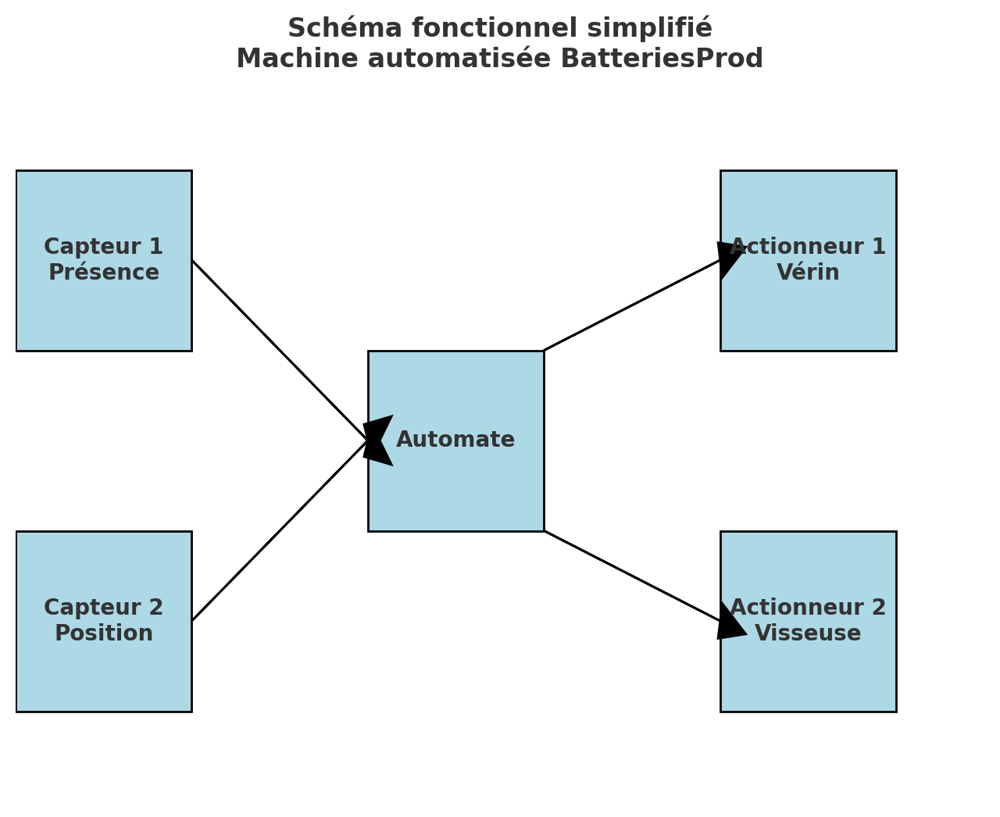

# Projet-Modbus-Anass

## User Story

En tant qu’opérateur de ligne,
je veux que la machine automatisée détecte l’arrivée d’une batterie, la positionne correctement, puis réalise automatiquement le vissage du couvercle,
afin de réduire les interventions manuelles et assurer un assemblage rapide et sûr.

## Fonctionnement

Capteur 1 : Détecteur de présence → confirme qu’une batterie est arrivée sur le convoyeur.

Capteur 2 : Détecteur de position → vérifie que la batterie est bien centrée sous la visseuse.

Actionneur 1 : Vérin de blocage → maintient la batterie en place pendant l’opération.

Actionneur 2 : Visseuse automatique → effectue le serrage du couvercle.

## Critères d’acceptation

Quand le capteur 1 détecte la batterie, le convoyeur s’arrête.

Si le capteur 2 confirme le bon positionnement, le vérin (actionneur 1) se déploie pour bloquer la batterie.

Une fois bloquée, la visseuse (actionneur 2) démarre automatiquement.

À la fin du vissage, le vérin se rétracte et le convoyeur redémarre.

En cas de non-détection du capteur 2, la machine reste en attente et signale une erreur à l’opérateur.

### Illustration
