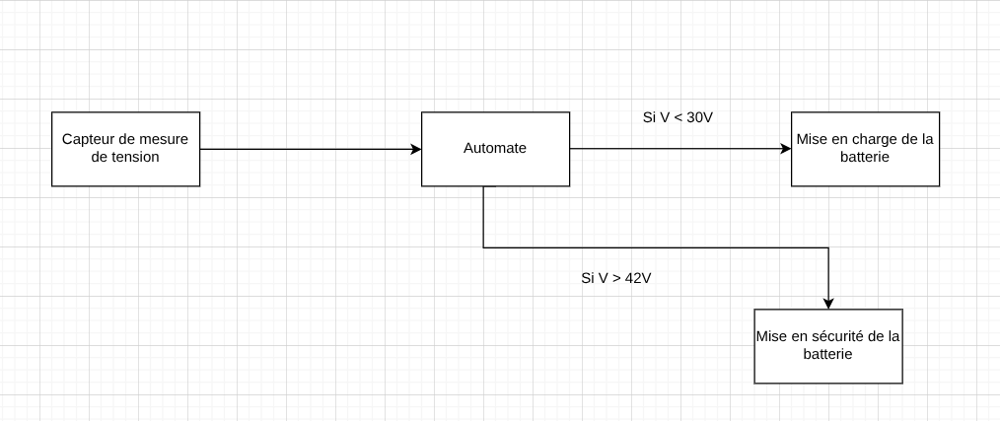

# Projet-Modbus-Anass

## User Story

Une batterie alimente une caméra vdéosurveillance qui fonctionne 24H/24, je veux que le système détécte lorsque la batterie atteint la charge maximum ou minimum, afin d'optimiser le cycle de recharge et donc garder la batterie le plus longtemps possible.

## Fonctionnement

Capteur 1 : Capteur de mesure de tension : mesure la tension de la batterie.

Actionneur 1 : Active ou désactive la charge de labatterie 

## Critères d’acceptation

Quand le capteur 1 mesure la tension de la batterie, un afficheur affiche la partie entière.

Si la tension est supérieur ou égale à 42V alors le chargeur se met en sécurité et n'alimente plus la battere

Une fois déchargée, en dessous de 30V, le chargeur est activé.

### Illustration
